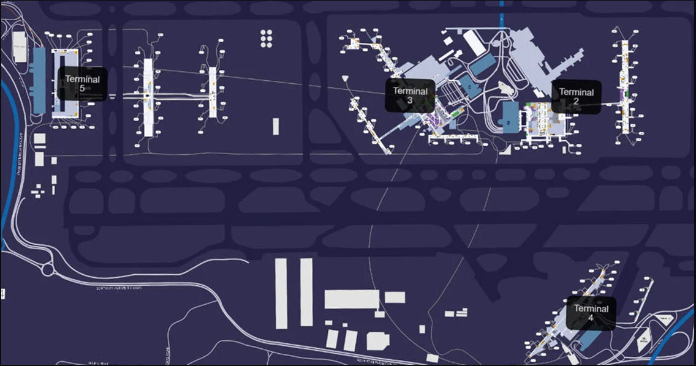
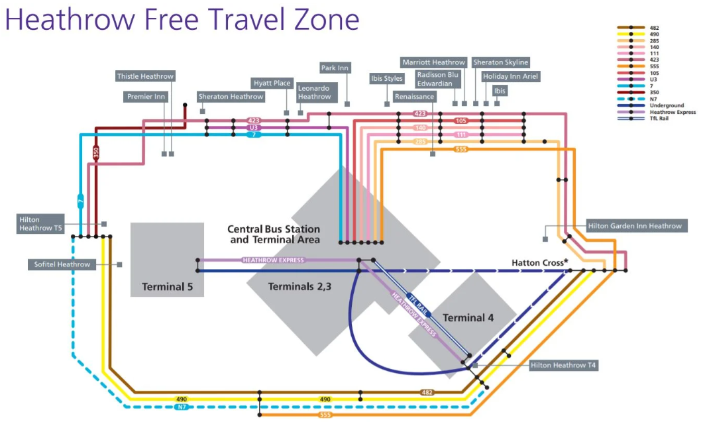

 
 
 

# cork-athens-june2022

* [tasks](./tasks.md)

## ORK --> LHR
* Booking reference: **LJV63K**
* BA5922 Aer Lingus Economy
* Confirmed
* **Saturday 18 Jun 2022 16:15 Cork**  
* ---> 18 Jun 2022 17:35 Heathrow (London) Terminal 2
* Hand baggage: [View your Aer Lingus allowance](https://www.mybaggage.com/shipping/airlines/aer-lingus-baggage-allowance/#:~:text=Aer%20Lingus%20Cabin%20Baggage,25%20x%2033%20x%2020cm.)  
* Checked baggage: **1 bags at 23kg** (51lbs)
* Meal

## LHR ---> ATH
* Same Booking reference: **LJV63K**
* BA0634 British Airways, Euro Traveller
* Confirmed
* **18 Jun 2022 20:20 Heathrow (London) Terminal 5**
* ---> **19 Jun 2022 02:00 Athens**
* Hand baggage: 1 handbag/laptop bag, plus1 additional cabin bag 
* Checked baggage: **1 bags at 23kg** (51lbs)
* Food and Beverages for Purchase

## Transfer Terminal 2 to 5
* [Getting between terminals](https://www.heathrow.com/at-the-airport/airport-maps/travel-between-terminals)

Free London Underground services and shuttle trains are currently available for Inter-Terminal Transfer between Heathrow Terminals 2&3 and Heathrow Terminal 5.

Please note that a Transport for London Oyster card or contactless payment mechanism is required to activate the ticket gates on London Underground services, but you won’t be charged for your journey as long as you only travel between terminals. If you are using Heathrow Express or TfL Rail, please obtain a free Inter-Terminal Transfer ticket from one of the machines in the station for your journey.

Average journey time: 20 minutes

* [How to Get Between Terminals at London Heathrow Airport](https://upgradedpoints.com/travel/airports/getting-between-terminals-london-heathrow-lhr-airport/)

* [Top 100 biggest and busiest airports in Europe](https://gettocenter.com/airports/continent/europe)